# Celtic Tiles


***
## Introduction

This a Django based (fictional!) e-commerce application which is the last of 5 required [Code Institute](https://codeinstitute.net/ie/) portfolio projects.

Celtic Tiles is the online store of a small business based in the West of Ireland, specialising in floor tiles. The store offers a variety of floor tiles and all wall tiles. Currently the business offers in-store collection of orders only with a limited range of home delivery planned for the future.
On their site, Celtic Tiles also host a blog about all things tiles. Articles published by the business itself are posted on a regular basis, offering helpful advice about tiles, interesting facts about different tiles or the latest recommendations on maintenance etc.


[Link to live site](https://celtic.herokuapp.com/) 

## Table of Contents

- [UI/UX](#uiux)
    - [Agile development](#agile-development)
    - [Wireframes](#wireframes)
    - [Site Goals](#site-goals)
    - [5 Planes of UX](#5-planes-of-ux)
    - [Visual Design Choices](#visual-design-choices)

- [SEO and Marketing](#seo-and-marketing)

- [Features](#features)
    - [Existing Features](#existing-features)
    - [Future Features](#possible-future-features)

- [Database Design](#database-design)
    - [Database Model](#database-model)
    - [Custom Model](#custom-model)
    - [CRUD](#crud)

- [Technologies Used](#technologies-used)
    - [Work Environments and Hosting](#work-environments-and-hosting)
    - [Python Libraries](#python-libraries)
    - [Django Libraries](#django-libraries)
    - [Payment processing](#payment-processing)
    - [Emails/Newsletter](#emailsnewsletter)
    - [SEO/Marketing](#seomarketing)

- [Testing](#testing)
    - [Test Guide](#test-guide)
    - [Validator Testing](#validator-testing)
    - [Browser Testing](#browser-testing)
    - [Fixed Bugs](#fixed-bugs)
    - [Unfixed Bugs](#unfixed-bugs)

- [Deployment](#deployment)

- [Development](#development)
    - [Fork](#fork)
    - [Clone](#clone)
    - [Download ZIP](#download-as-zip)

- [Source Credits](#source-credits)
    - [References/Documentation/Tutorials](#referencesdocumentationtutorials)
    - [Media and Styling](#media-and-styling)
    - [Content/Data](#contentdata)
    - [Credits](#credits)
    - [Technologies](#technologies-used)
    - [Acknowledgements](#acknowledgements)


## UI/UX

The overall design of the site follows a simplistic, earthy style. This reflects the product and their usage themselves, as well as the kind of lifestyle potential customers would potentially aspire to. 

As this business is not dealing in novelty products but everyday use tiles, flashy website features are currently not implemented. This is down to the fact that most expected customers will be based in  Ireland where internet connection is often very limited. Therefore the site should not be bloated with features that serve no purpose other than being showy.


## Agile development

### User stories

To create user stories as per principles of agile development, we used **kanban** board in our development which is part of Github Projects.
We separated user stories into 5 logical categories, or milestones, and furthermore added assigned tasks and requirements. For illustrative purpose we will only list user stories with associated milestones here.

For full details please check out our link on Github: [V.S. Store User Stories](https://github.com/users/Tinks18/projects/21)

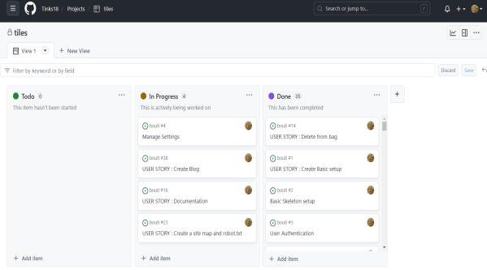

#### EPIC | Navigation

* As a user I can easily navigate trough the website so that i can access acces preffered content
* As a user I can view list of products so that i can chose ones i like
* As a user I can open selected product so that i can see more details about it
* As a user I can sort products by category so that i can view only by preferred category
* As a user I can use search function so that i can find products quickly

#### EPIC | Purchasing

* As a customer I can select size and quantity so that i can purchase products that fit me
* As a customer I can add products to bag so that i can make purchase
* As a customer I can access my shopping bag so that i can add, remove or update products in it
* As a customer I can easily see subtotal so that i can keep track with my budget
* As a customer I can acess checkout page and enter my details so that I can purchase selected products
* As a customer I can see order confirmation so that i know order was placed correctly
* As a customer I can receive order email so that i have order receipt and details archived in email

#### EPIC | Authentication

* As a user I can create account (register) so that i can access additional features
* As a user I can log in/out from account so that i can have registered user privileges
* As a registered user I can have personalised user account so that i can store personal details like address or purchase history
* As a user I can easily see login status so that i can act accordingly and adress privacy or safety issues
* As a user I can receive email after creating user account so that i know registration was successful
* As a registered user I can recover my password so that i can still access the site in case of forgotten password

#### EPIC | Administration

* As an admin I can access admin panel so that i can use admin features and manage website
* As a site admin I can add or delete products so that i can manage site content / store stock

#### EPIC | Interaction

* As a user I can fill in the contact form so that I can contact store directly
* As a user I can subscribe to the newsletter so that i can be up to date with new products or promotions
* As a user I can access media links so that i can discover more of authors work or contact trough other means
* As a registered user I can write a product review so that i can give an honest feedback
* As a user I can like products so that i can save them to wishlist for future reference
* As a user I can read about page so that i can know more about site or owner

### Wireframes

The initial [wireframes in Figma](https://www.figma.com/file/tgnMK74N3IZiCVPdSO5K9I/CELTIC-TILES-DESIGN?type=design&node-id=0-1&mode=design&t=qAXnOEmCxTGdlqVO-0) are an overly simplified version of the finished product and merely served the purpose of listing most of the site's essential features.

Not all features and functions are covered by these first drafts. For a full list of existing features see [Features](#features)

<details>
    <summary>
        Wireframe images
    </summary>
    Home-first draft: 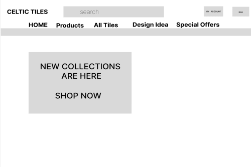
    Home-Page: 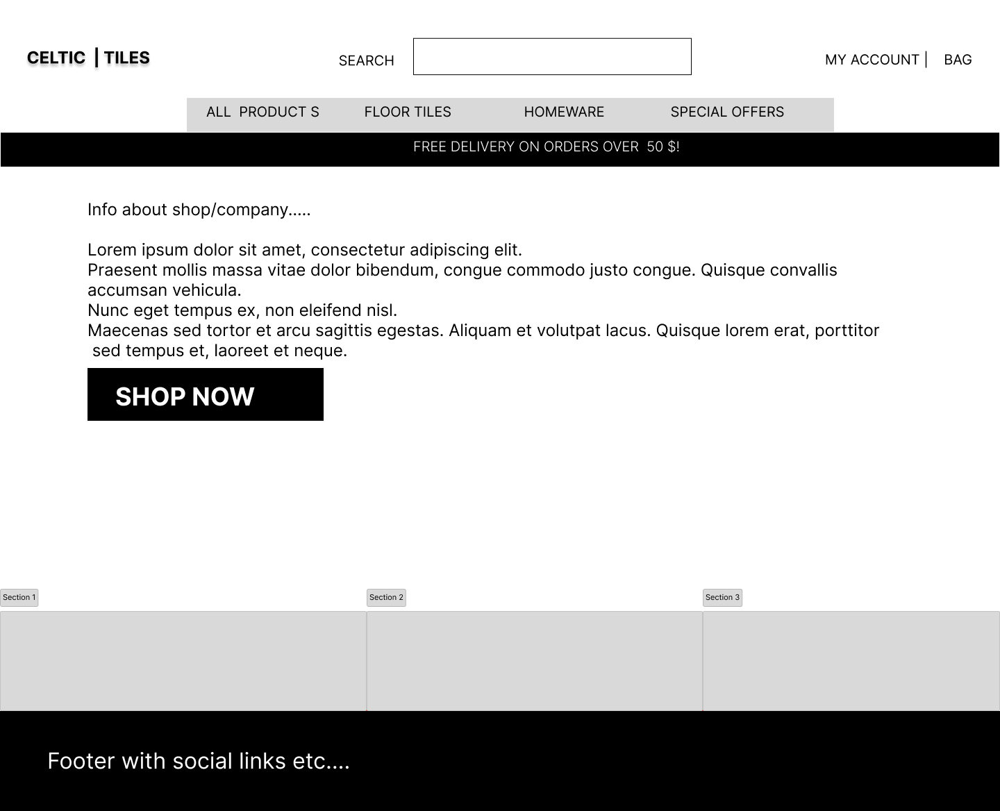
    Login: 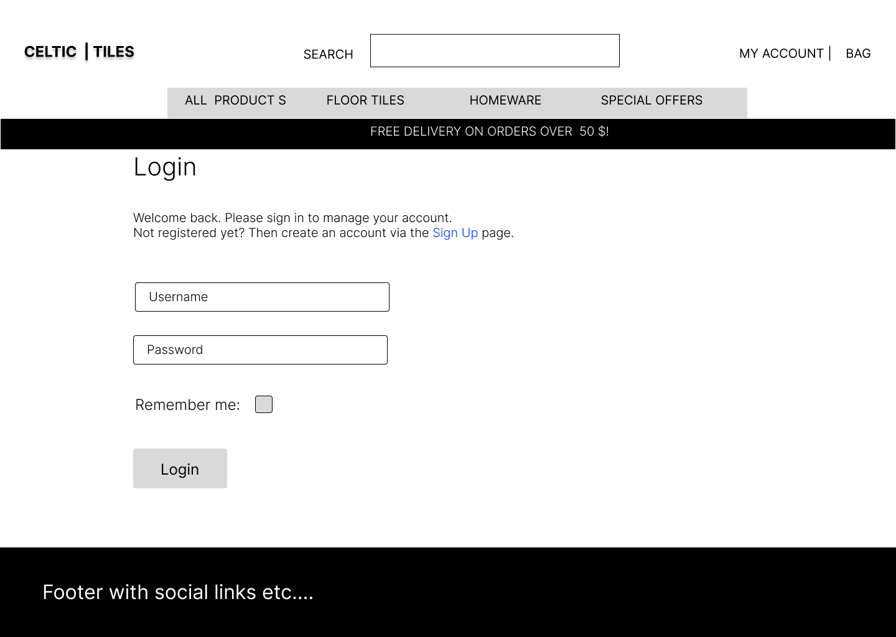
    SignUp: 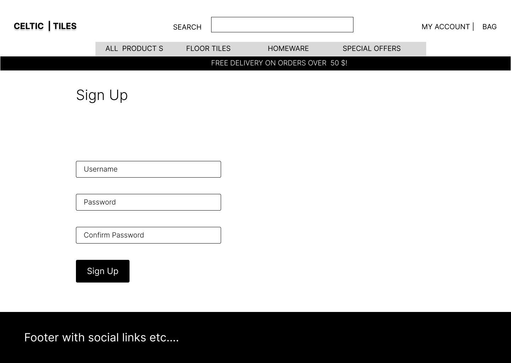
    Product: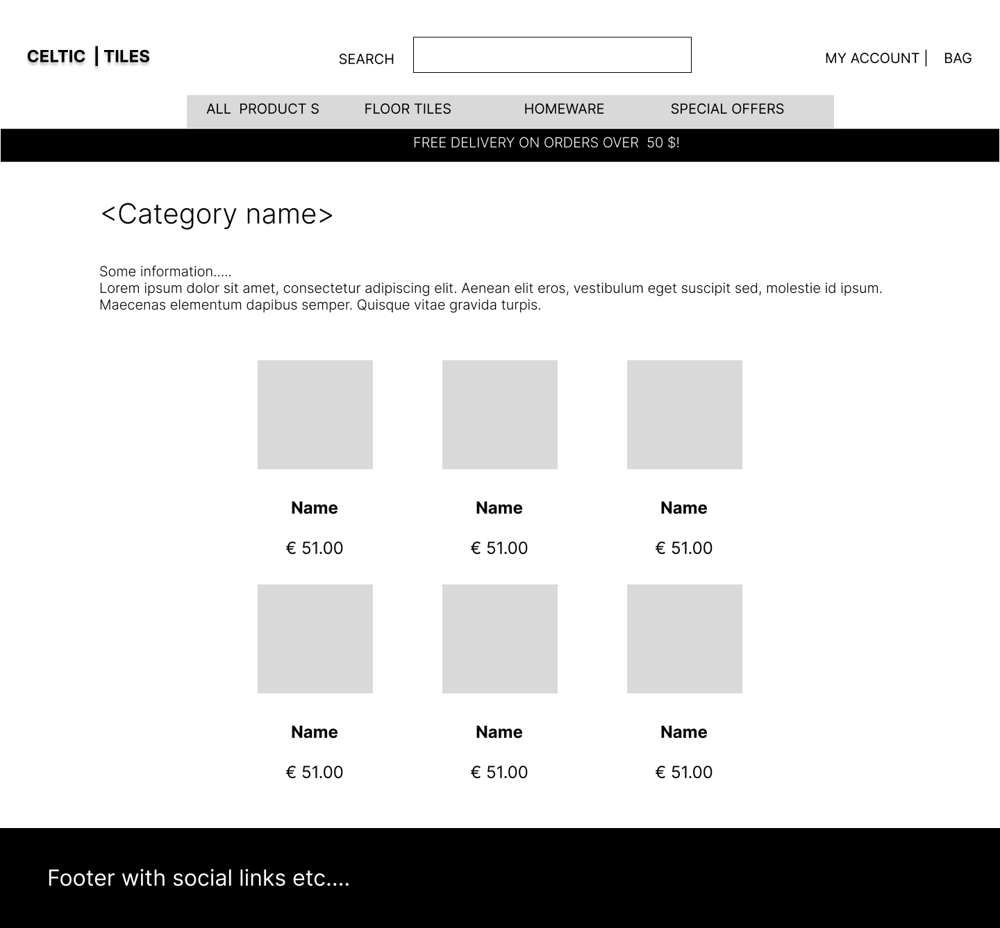
    Product Details: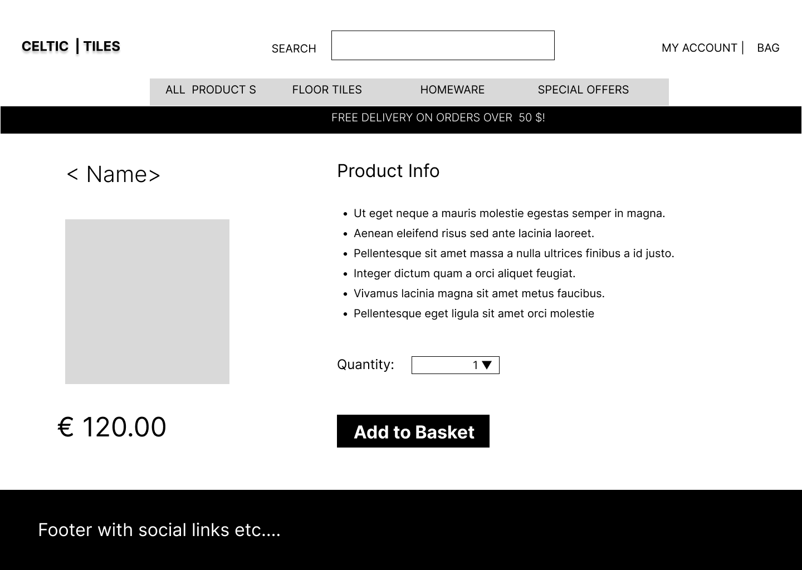
    Basket: 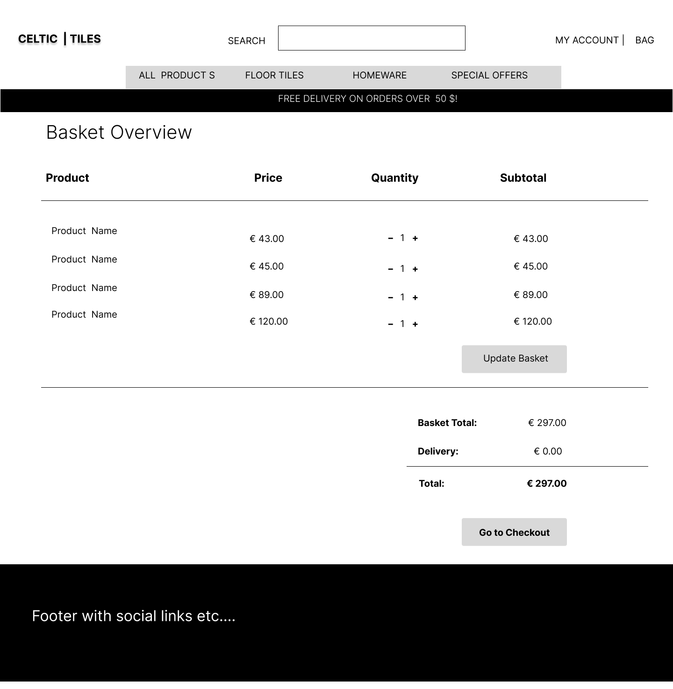
    Checkout: 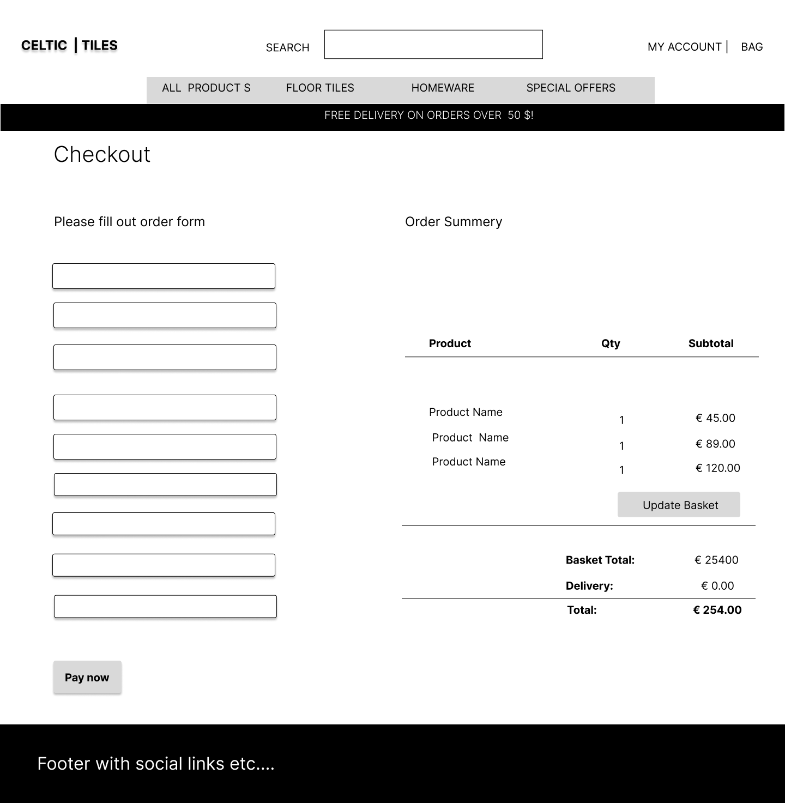
    Profile: 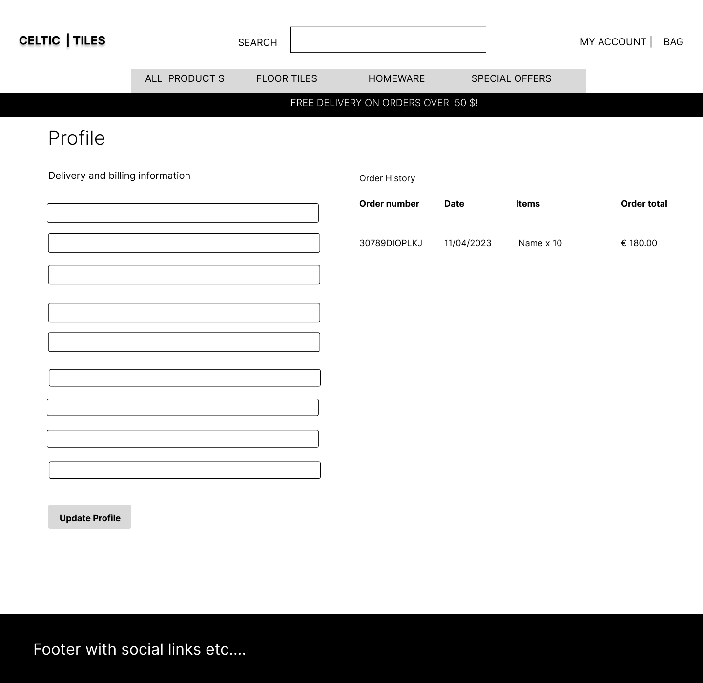    
</details>

### Site Goals

This site is the online shop of the fictional supplier of floor and wall tiles "Celtic Tiles". This business is based in Dublin, Ireland and is aiming to cover a customer base in the Dubin of Ireland. Mainly counties in Dublin city.

On the site, customers can view different types of tiles the business offers. Tiles can be ordered and paid for via an intuitive, straight forward process. As the products are heavy, this business offers shipping. The customers are informed that orders can be collected from the business warehouse.

"Celtic Tiles" is very keen as a business to provide past and future customers with useful advise and support about floor tiles  As well as general contact details, the shop's site also features a blog maintained by the business itself, where all visitors of the site can find helpful articles on various subjects related to floor and wall tiles.

### 5 Planes of UX

#### Strategy

Strategy
Considering the core UX principles I first started to think about the strategy for this website and defined who the target users would be and what features/technologies they would want.

Celtic Tile's target users are:

Aged 18-80
Past/future home improvement enthusiasts
People interested in garden and interior decoration
Have an interest in visiting showroom
What these users would be looking for:

Clear, concise, easy-to-find information
Beautiful photos that provide inspiration and make the products look desirable
Helpful guidance on materials required
Recommendations for types of tiles
This website will offer all of these things whilst also allowing for intuitive navigation and comfortability of use. An effort was taken to not provide an overwhelming amount of information at first glance as this is often the reason people are put off with guides.

Due to the age group of the users, it is assumed that most users will be viewing the site on their mobile phones and therefore creating something responsive is integral to the design.

Addresses user's needs and product objectives.
The user here has been identified as a person residing in the Dublin region of Ireland who is interested in buying or already planning for home improvements.
Their needs are therefore a selection of different types of floor tiles (with different purposes), an easy way of making a selection from those and a simple payment method along with the selection process. 
Outside of the purchasing needs, the user might also require advise and information on the products offered by the business. This is addressed in the site's blog page.

*Site owner user:*

The owner of the site (or business employee) wants to be able to maintain the site without effort and via an appealing UI.

#### Scope

Addresses what functions and features are within the scope of the project.
Basic and essential e-commerce functionality was key to this project. This means that most features included are a basic requirement. Features like user sign up and login, user profile creation, checkout functionality and secure online payment had to be implemented, as well as basic CRUD funtionality for authorised users. For detailed explanation of all existing features see [Existing Features](#existing-features).
Features discussed under [Future Features](#possible-future-features), while still within the possible scope of this project, were deemed unnecessary at this point in time.

*Site owner user:*

To meet the site owners basic needs, each product can be easily updated or deleted via the front-end interface. New products can also be added via the front-end. Blog posts are handled the same way. All these features are only accessible to authorised users.

#### Structure

Defines how users can navigate the site and utilise all existing features.
The structure of the site is modelled on a basic e-commerce application with an additional blog page.
The structure allows users to browse products and make purchases as well as visit the blog to find information about floor tiles. Authenticated users can store their personal information in a user profile for the purpose of faster order handling.

*Site owner user:*

All CRUD functionality is placed intuitively with the relevant features of the site (individual products, blog posts). A super-user can avail of the same navigation options as as any authenticated users. However, these include additional features limited to authorised users.

#### Skeleton

Puts features defined in structure into navigational elements.
For a first outline of the project skeleton see [Wireframes](#wireframes).
To guarantee intuitive navigation of the site, both the navbar and the main content follow a standard layout pattern that should be familiar to most users.
The navbar provides links to the main features and functions of the site, varying based on whether a user is authenticated or not. On small to medium screen sizes a drop-down burger menu takes the place of the full navbar. A second-option home button is in place as a small logo, opposite all other nav links. According to research, this is also common practice.
The shopping basket link in the navbar is being updated everytime a user adds an item (of a differnt type!) to the basket.
Products and categories, as well as blog posts are listed in a card-style display.
All forms are cleary labelled an inform the user of invalid fields. User feedback is represented throughout the whole site via alert pop-ups.
Buttons and links are appropriately named.
A footer with social media links (currently merely serve as placeholders) completes the "framing" effect of the site.

#### Surface

Addresses visual design and how to convey desired emotions and achieve desired effects.
For more detail on the planning of the surface plane, see [Visual Design Choices](#visual-design-choices).


### Visual Design Choices

**Colour Scheme:**

The site utilises one accent colour (``primary-color: #FFF``) and a slightly darker gradient of the same colour (``primary-color-dark: #fff``) for the purpose of focusing in on elements. The colour was chosen for its warm, earthy quality, somewhat reminiscent of shiny tiles. It also offer high enough colour contrast when used with a font colour of black and is therefore in keeping with accessibility standards.


**Fonts:**

One extravagant font ("Pacifico") was chosen solely for the shops logo and can be found throughout the site where name branding is used.
The main font ("Varela Round") combines ease or readability with friendly appearance. 
For full despcription of font names and their sources see [Media and Styling](#media-and-styling)

**Images and Icons:**

All images of this site are purely related to the products offered in the store or relevant to the individual blog post. Apart from the banner image on the home page, the site refrains from using too many decorative elements.
Icons used for the purpose of navigation are standards symbols which should be familiar to most users.
For full despcription of all images and their sources see [Media and Styling](#media-and-styling).


## SEO and Marketing

For an extensive overview of the marketing research for this project, please refer to this [SEO and Marketing documentation](MARKETING.md)


## Features

### Existing Features

#### Global and Home

**Navigation**

- Responsive navbar with burger dropdown menu
- Shop logo as default home link
- Navigation options dependant of user authentication/authorisation

- 
- Navigation on mobie devuces:
- 


**Footer**
- General info about store 
- Contact info incl. address, phone number and email
- Shop opening hours
- Footer element with social media links
- Contains link to privacy policy
- Newsletter sign up option

- 
- footer on mobile devices:
- 

**Home page**

- Home page with banner image and introduction
- Shop Now button ("Buy Tiles")


**About page**

- General info about store 


**Privacy policy**

- Standard GDPR compliant privacy policy page 
- Linked to in footer


Image does not contain entire policy document. Visit site to view full policy.

**404 Error page**

- Customised 404 error page with witty message
- Informs user of invalid URL
- Back button redirects user back to home page


**User feedback**

- Alert messages inform user of:

    - Actions about to be performed
    - Actions successfully completed
    - Actions failed to complete


#### Authentication

**Sign Up**

- Allows new users to create account
- Sign up process includes confirmation email with confirmation link


**Login**

- Allows existing users to log into their account
- Includes Remember me checkbox and Forgot Password option


**Logout**

- Allows authenticated users to securely log out of their account


#### Products

**All Products page**

- Lists all categories of products
- Links to blog and contact info


**Products page (of same category)**

- Lists all products of the same category
- Quick link to All Products page


**Product details page**

- Product image, description and price
- Quick link to respective category
- Quantity input
- Continue Shopping button ("Browse more")
- Add to basket button
- Edit and delete option for authorised users for each product


**Add Product page**

- Authorised admin users only!
- Complete product form with image upload option
- Cancel button
- Add product button to add product to database


**Edit Product page**

- Authorised admin users only!
- Complete product form with image upload option
- Form is pre-populated with existing product's details
- Cancel button
- Update product button to update existing product in database


**Delete Product option**

- Authorised admin users only!
- Option on product details page
- Request for user confirmation before deleting product
- Cancel button
- Delete button to delete existing product from database


#### Shopping Basket


**Shopping Basket**

- Tabular view of currently selected products and their quantity
- Quantity adjustment option
- Product removal option
- Display of subtotal, delivery cost (currently always 0) and grand total
- Continue shopping button
- Proceed to checkout option


#### Checkout

**Checkout page**

- Checkout form, including sections for personal info, contact details and card details
- Option to save details to profile for authenticated users
- Current order summery
- Edit Basket button
- Pay now button


**Checkout Success page**

- Confirms successfull order and informs user that email was sent to the address specified
- Displays order details, contact and billing info
- Continue Shopping button ("Back to products")


#### Profile

**User Profile page**

- Contact address form (pre-populated if user has previously saved his info)
- Update Info button
- Listing of past orders in order history


#### Celtic Blog

**Blog page**

- Lists all  entries in tile format
- Tiles show title, excerpt, image, create-date and category
- Category button filters all entries by respective category (see below)


### Possible Future Features

**Extended product range**

The shop has the potential to extend its product range to non-livestock products, such as bird coops, feed, bedding and miscellaneous.
For the purpose of this project however, it was unnecessary to implement such a broad product database.

**Search option**

A search bar could be included in the header or be accessible throughout all products related pages of the site. Currently the product selection is so small that a search bar was deemed unnecessary but would make sense to implement along with an extended product range.

**Automated pick-up date selection**

Currently, the arrangment of a date for product collection is handled manually by shop employees via email or phone contact directly with the customer after order completion.
This could be automated by including calendar element with date picker option to be used after an order is complete.

**Delivery depending on customer location**

 Delivery would need to be done by a shop employee with special transport , on an arranged day and as direct as possible. As this is supposed to be a small business, offering a nationwide delivery would seem unrealistic.
 This might make the business a little less competitive but does not impede on the business logic as a whole.


**Blog response approval via front-end**

Currently the approval of user responses to blog entries by admin users is happening solely via the Django admin dashboard. 
There was a valiant attempt at moving this functionality to the front-end for authorised superusers. 


## Database Design

### Database Model

The database model diagram was designed using
[Lucidchart](https://lucid.app/publicSegments/view/7e703d23-789a-4ede-8cd1-6ab33b9c8684/image.png).
The first draft of the entity relationship diagram does not include all models used in the final database.

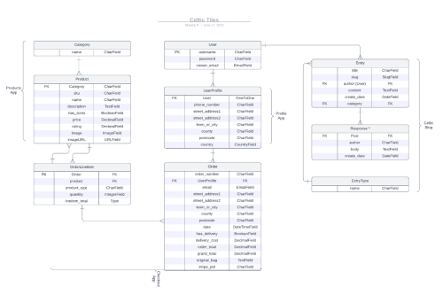


### Custom Model

As required by the assessment criteria for this project, three custom models were added which were covered by the Code Institute tutorial this project is based on. These models are ``EntryType``, ``Entry`` and ``Response``, all of the blog app (blog/models.py).


### CRUD

Full CRUD functionality via the front-end UI is implemented for admin users in the Blog app and the Products app. 

**Create:**

*Blog:* Create new blog post. 
*Products:* Add new product. 

**Read:**

*Blog:* Read all existing blog post. 
*Products:* View all existing products. 

**Update:**

*Blog:* Edit existing blog post. 
*Products:* Edit existing products. 

**Delete:**

*Blog:* Delete existing blog posts. 
*Products:* Delete existing products. 

For a detailed description of all CRUD features see [Features](#features)

## Technologies Used

### Work Environments and Hosting

- [Figma](https://www.figma.com/) (Wireframes)
- [Lucid](https://lucid.app/) (ERD diagrams)
- [GitHub](https://github.com/) (Version control)
- [GitPod](https://gitpod.io/) (IDE)
- [Heroku](https://heroku.com/) (Site hosting)
- [AWS - Amazon Web servises (S3)](https://aws.amazon.com/) (Hosting static and media files)


### Python Libraries

- [Gunicorn](https://docs.djangoproject.com/en/4.1/howto/deployment/wsgi/gunicorn/) (Python HTTP server for WSGI applications)
- [pyscopg2](https://pypi.org/project/psycopg2/) (PostgreSQL Database adapter)
- [Pillow](https://pypi.org/project/Pillow/) (Python Imaging Library)
- [boto3](https://boto3.amazonaws.com/v1/documentation/api/latest/index.html) (integrates python libraries with AWS services)
- [django-storages](https://django-storages.readthedocs.io/en/latest/) (collection of custom storage backends for Django)
- [Flake8](https://flake8.pycqa.org/en/latest/) (Python linter used for python code validation)

### Django Libraries

- [django-allauth](https://django-allauth.readthedocs.io/en/latest/) (User authentication)
- [django-crispy-forms](https://django-crispy-forms.readthedocs.io/en/latest/) (Control rendering behaviour of Django forms)
- [Bootstrap5 template pack for django-crispy-forms](https://pypi.org/project/crispy-bootstrap5/)
- [django-summernote](https://github.com/summernote/django-summernote) (WYSIWYG HTML editor)

### Payment processing

- [Stripe](https://stripe.com/) (Online payment platform)

### Emails/Newsletter

- [Gmail](https://mail.google.com/) (Real email sending)
- [Mailchimp](https://mailchimp.com/) (Automated newsletter subscription service)


### SEO/Marketing

- [XML Sitemaps](https://www.xml-sitemaps.com/) (Sitemap generator)
- [Privacy Policy Generator](https://www.privacypolicygenerator.info/)

## Testing

### Test Guide

For extensive instructions on how to manually test this site and it's user stories, please refer to these [Manual Testing Instructions](TESTING.md)


### Validator Testing

#### HTML [W3C validator](https://validator.w3.org/)

As this is a Django project, the HTML couldn't be tested via the site's URL, due to Django tags and Jinja templating language in HTML files. Instead, the source code of each page was pasted into the validator directly.

#### CSS [Jigsaw](https://jigsaw.w3.org/css-validator/)

No errors found.


#### JavaScript [JSHint](https://jshint.com/) 

**Basket app**

*quantity_input_script.html*: 

No errors or warnings

*basket.html (line 88-104)*: 

2 warnings: Missing semicolons

Fix: Add semicolons

**Checkout app**

*stripe_elements.js*: 

1 warning: Missing semicolon

Fix: Add semicolon

1 undefined variable ``Stripe``, line 11

Fix: No fix required, variable is inherent in Stripe functionality 


**Products app**

*quantity_input_script.html*:

No errors or warnings

*product_details.html*:

No errors or warnings

**Global**

*base.html*:


All error and warnings in the above result refer to the default script that comes with the MailChimp newsletter functionality. Therefore no fix is required. 


#### Python [Flake8](https://flake8.pycqa.org/en/latest/user/invocation.html)

As there are a multitude of python files throughout this project, rather than testing each file individually in an external validator (huge time investment!), I opted for running the python linter Flake8 in editor via the CLI with ``python3.8 -m flake8``.

Any files auto-generated by Django or not written by myself were ignored in terminal output.

I also decided that (unused) imports in Django files that are inherent to those types of files and automatically imported by Django were safe to ignore.

Only unused variables and imports that I deemed truely unnecessary were removed in the end.


#### Performance, Accessibility, SEO, Best Practices (Lighthouse Chrome DevTools)

**Desktop results**


The yellow scores in Performance and Best Practices are due to referencing external libraries and technologies such as Bootstrap, JQuery and Stripe that the project depend on and cannot be removed.

**Mobile results**


The yellow score in Performance is due to referencing external libraries and technologies such as Bootstrap, JQuery and Stripe that the project depend on and cannot be removed.

### Browser Testing

**Layout:** 

Testing layout and appearance of site for consistency across browsers.

**Functionality:** 

Testing complete functionality of the site as specified in the [Manual Testing Instructions](TESTING.md) accross browsers.

| Browser     | Layout      | Functionality |
| :---------: | :----------:| :-----------: |
| Chrome      | ✔          | ✔             |
| Edge        | ✔          | ✔             |
| Firefox     | ✔          | ✔             |
| Safari      | ✔          | ✔             |
| IE          |deprecated by Microsoft, not tested|

### Fixed bugs

- will sees

### Unfixed bugs

There are currently no known bugs 😀


## Deployment

This project was deployed using [Heroku](https://heroku.com/), [ElephantSQL](https://www.elephantsql.com/) and [AWS](https://aws.amazon.com/). For a full list of libraries refer to [Technologies Used](#technologies-used).

#### Installing libraries

The following steps outline all libraries needed for successful deployment on Heroku. All necessary requirements and settings updates will not be discussed in this section as they are assumed as logical follow-up steps to installments. For full explanation on how to install these libraries, refer to the links provided in [Technologies Used](#technologies-used).

- Install **pyscopg2** (connects to PostgreSQL): ``pip 3 install dj_database_url pyscopg2``
- Install **Gunicorn** (server used to run Django on Heroku): ``pip3 install django gunicorn``

#### Creating the Heroku App

- Log into Heroku and go to the Dashboard
- Click **New** and select **Create new app** from the drop-down
- Name app appropriately and choose relevant region, then click **Create App**

#### Create PostgreSQL database using ElephantSQL

This is necessary to create a database that can be accessed by Heroku. The database provided by Django can not be accessed by the deployed Heroku app.

- Log into ElephantSQL and go to Dashboard
- Click **Create New Instance**
- Set up a plan by providing a Name (project name) and select a Plan (for this project the free plan "Tiny Turtle" was chosen). Tags are optional.
- Click **Select Region** and choose appropriate Data center
- Click **Review**, check all details and click **Create Instance**
- Return to Dashboard on click on the name of the newly created instance
- Copy the database URL from the details section

#### Hiding sensitive information

- Create ``env.py`` file and ensure it is included in the ``.gitignore`` file
- Add ``import os`` to env.py file and set environment variable **DATABASE_URL** to the URL copied from ElephantSQL (``os.environ["DATABASE_URL"]="<copiedURL>"``)
- Below, set **SECRET_KEY** variable (``os.environ["SECRET_KEY"]="mysecretkey"``, but be more inventive about the key string!)

#### Update Settings

- Add the following code at the top of ``settings.py`` to connect Django project to env.py:
    ````
      import os
      import dj_database_url
      if os.path.isfile('env.py'):
          import env
    ````
- Remove insecure secret key provide by Django in settings.py and refer to variable in env.py instead (``SECRET_KEY = os.environ.get('SECRET_KEY')``)

- To connect to new database, replace provided **DATABASE** variable with 
    ````
    DATABASES = {
        'default': dj_database_url.parse(os.environ.get("DATABASE_URL"))
    }
    ````
- Save and migrate all changes made and load in fixtures

#### Preparing for Heroku

- Create Procfile (tells Heroku to create web dyno which will run gunicorn and serve Django app)

- Temporarily disable collectstatic (prevent Heroku from collecting static files when deploying)

- Allow Heroku as host:

    In ``settings.py`` add
        ````
        ALLOWED_HOSTS = ['app-name.herokuapp.com', 'localhost']
        ````

#### Connecting Heroku to Database

- In Heroku dashboard, go to **Settings** tab
- Add three new config vars **DATABASE_URL** (value is database URL), **SECRET_KEY** (value is secret key string) and **PORT** (value "8000")


#### Deyploying with Heroku

- In Heroku dashboard, go to **Deploy** tab
- Select "GitHub" as Deployment method and choose correct repo
- Enable Automatic Deploys
- Click "Deploy Branch" button


#### Hosting images and static file with AWS

- Create AWS account and go to AWS Management Console in the My Account dropdown
- Find and access S3 as a service and create a new bucket:

    Under Object Ownership, check "ACLs enabled"

    Uncheck "Block all public access" and acknowledge (required for public access to static files)

- Configur bucket settings:

    Under **Properties**, enable Static Website Hosting

    Under **Permissions**, copy the following code into CORS section:

    ```
    [
        {
            "AllowedHeaders": [
                "Authorization"
            ],
            "AllowedMethods": [
                "GET"
            ],
            "AllowedOrigins": [
                "*"
            ],
            "ExposeHeaders": []
        }
    ]
    ```
    This is required to set up the access between the Heroku app and the S3 bucket.

    Under **Bucket policy**, go to Policy generator.

    Bucket Type = S3 Bucket Policy

    Principal = * (allows all principles)

    Actions = GetObject

    Paste in ARN from bucket settings tab.

    Click Add Statement, then Generate Policy.

    Copy policy in paste into bucket policy editor. Also add ``/*`` onto the end of the resource key.

    Click Save.

    Under **Access control list (ACL)**, check "List" checkbox for "Everyone (public access)"

- Create user to access bucket with IAM (Identity and Access Management)

    In IAM, got to User Groups (sidebar left).

    There create a group for a user, create an access policy giving the group access to the S3 bucket and assign the user to the group so it can use the policy to access all files. 

- Connect Django to S3

    Install packages "boto3" and "django-storages" and add ``'storages'`` to INSTALLED_APPS  in settings.py

    Configure settings.py accordingly, including necessary AWS variables.

    Add new config vars in Heroku app settings, including user credentials from AWS.

    Create ``custom_storages.py`` file.

- Upload static files and media files to S3


#### Add Stripe keys to Heroku

From Stripe account, under Developers > API keys copy Public Key and Secret Key and set as config vars in Heroku app settings.

Create new Webhook endpoint for deployed site and enable all events. Then add Signing Secret to Heroku app config vars.


## Development

The following options are available to work with this code or run in a local environment.

### Fork

Any changes made to a forked repository do not affect the original repository.

- Log into GitHub and click on repository to download ([Celtic-Tiles](https://github.com/Tinks18/bouti))
- Click the **Fork** buttonin the top right-hand corner
- Select a different owner if necessary
- Click **Create Fork**
- The repo is now in your chosen account and can be cloned or changed

### Clone

Changes made to a cloned repository will affect the original one.

- Navigate to the main page of the repostitory (this could be a forked instance)
- Click on the **Code** dropdown menu above the list of files
- Choose a method to copy the URL for the repository: either via **HTTPS**, by using an **SSH key**, or by using **GitHub CLI**
- In your work environment, open Git Bash and change current directory to target location for cloned repository
- Type ``git clone`` followed by the copied URL and press enter **Enter**

### Download as ZIP

- Log into GitHub and click on repository to download ([cletic_tiles](https://github.com/Tinks18/bouti))
- Select **Code** and click "Download Zip" file
- Once download is completed, extract ZIP file and use in your local environment


## Source Credits

### References/Documentation/Tutorials

**General**:

The official [Django Documentation](https://docs.djangoproject.com/en/4.1/) was used throughout creating this project.
The skeleton of this project is based on the [Code Institute](https://codeinstitute.net/ie/) tutorial ["Boutique Ado"](https://github.com/Code-Institute-Solutions/boutique_ado_v1/tree/250e2c2b8e43cccb56b4721cd8a8bd4de6686546).


**User alerts (toasts/messages)**:

The live feedback messages to alert user actions were implemented using the [Django message framework](https://docs.djangoproject.com/en/4.1/ref/contrib/messages/) and the respective [message levels](https://docs.djangoproject.com/en/4.1/ref/contrib/messages/).

The alert pop-up frames were rendered using [Bootstrap 5 toasts](https://getbootstrap.com/docs/5.0/components/toasts/).

**Custom error pages**:

To implement custom error pages in Django I followed this [Code Institute](https://codeinstitute.net/ie/) tutorial ["Boutique Ado"](https://github.com/Code-Institute-Solutions/boutique_ado_v1/tree/250e2c2b8e43cccb56b4721cd8a8bd4de6686546).


### Media and Styling

**Images:**

- The photos used on the home and sign up page are from the open source site free to use tile images.
- The images used for the gallery page were taken from this other open source site [unspash](https://www.unsplash.com/)


Discalimer: All content has been used only for educational purposes to create a project and is not for commercial use.

**Fonts:**

All fonts were taken from [Google Fonts](https://fonts.google.com/).


**Icons:**

All icons were taken from [Iconify](https://icon-sets.iconify.design/). Included in this is the animated loading spinner icon of the checkout page.


### Content/Data

- The text for the Home page was taken from Srinivas Dasari
- Instructions on how to implement form validation on the Sign Up page was taken from [Specific YouTube Tutorial](https://www.youtube.com/)
- The icons in the  header footer were taken from [Font Awesome](https://fontawesome.com/)
- The Contact form  was taken from Bootstrap library
- Using the form dump provided by code institute to validate the form.


#### Products

All fixtures for the products app were manually compiled with data gathered from various online resources.


## Credits 

I have used a number of resources to produce this website, where code has been used found from another source this is credited as a comment within the HTML, CSS and JS files.

The following websites/articles were used for research and guidance:

- [Wireframes](https://careerfoundry.com/en/blog/ux-design/wireframing-mobile-apps-websites/)

- [Design tips](https://99designs.co.uk/blog/tips/responsive-web-design-key-tips-and-approaches/)

- [Media Queries](https://css-tricks.com/snippets/css/media-queries-for-standard-devices/)

- [Accessibility for burger menu](https://medium.com/@linlinghao/accessibility-for-hamburger-menu-a37fa9617a89) 

I used code from the following resources:

- [Responsive Navbar](https://www.w3schools.com/howto/howto_js_topnav_responsive.asp)

- [Animated scroll down arrow](https://codepen.io/JoshMac/pen/MaYEmJ)

- [Read more button](https://www.w3schools.com/howto/howto_js_read_more.asp)
    - This code was used but the JS function was heavily edited with the help of my tutor Guido.

- [Sign up form](https://wwww.w3schools.com)
    - I used this code as the basis of my form but changed the styling.

- [Image grid](https://www.freecodecamp.org/news/how-to-create-an-image-gallery-with-css-grid-e0f0fd666a5c/)

- [Fancybox gallery](https://fancyapps.com/fancybox/3/docs/#images)

- [Visually hidden elements](https://www.w3.org/WAI/tutorials/forms/labels/)

- Code snippets for the background styling on the contacts page and home page were taken from the "Love     Running project" of Code institute.
 

## Technologies Used 

I have used several technologies that have enabled this design to work:

- [HTML](https://developer.mozilla.org/en-US/docs/Web/HTML)
    - Used as the basic building block for the project and to structure the content.
- [CSS](https://developer.mozilla.org/en-US/docs/Learn/Getting_started_with_the_web/CSS_basics)
    - Used to style all the web content across the project. 
- [JavaScript](https://www.javascript.com/)
    - Used for the responsive navbar, form, scroll down arrow and read more/read less button.
- [Google Fonts](https://fonts.google.com/)
    - Used to obtain the fonts linked in the header, fonts used were Playfair and Cookie
- [Font Awesome](https://fontawesome.com/)
    - Used to obtain the social media icons used in the footer and the icons in La Petite Review.
- [Google Developer Tools](https://developers.google.com/web/tools/chrome-devtools)
    - Used as a primary method of fixing spacing issues, finding bugs, and testing responsiveness across the project.
- [GitHub](https://github.com/)
    - Used to store code for the project after being pushed.
- [Git](https://git-scm.com/)
    - Used for version control by utilising the Gitpod terminal to commit to Git and Push to GitHub.
- [Gitpod](https://www.gitpod.io/)
    - Used as the development environment.
- [Balsamiq](https://balsamiq.com/)
    - Used to create the wireframes for the project.
- [AutoPrefixer](https://autoprefixer.github.io/)
    - Used to parse my CSS and ass vendor prefixes.
- [Grammarly](https://www.grammarly.com/)
    - Used to fix the thousands of grammar errors across the project.
- [Unicorn Revealer](https://chrome.google.com/webstore/detail/unicorn-revealer/lmlkphhdlngaicolpmaakfmhplagoaln?hl=en-GB)
    - Used to detect overflow of elements, which allowed me to quickly debug any issues.
- [Coloors](https://coolors.co/)
    - Used to create a colour palette for the design.
- [Fancybox](https://fancyapps.com/fancybox/3/)
    - Used to format my Sri Lanka photo gallery.
- [Favicon.io](https://favicon.io/)
    - Used to create favicon's for my website
- [Tiny.png](https://tinypng.com/)
    - Allowed me to compress my images so that the page would load faster.
- [Color Contrast Accessibility Validator](https://color.a11y.com/)
    - Allowed me to test the colour contrast of my webpage.
- [W3C Markup Validation Service](https://validator.w3.org/) 
    - Used to validate all HTML code written and used in this webpage.
- [W3C CSS Validation Service](https://jigsaw.w3.org/css-validator/#validate_by_input)
    - Used to validate all CSS code written and used in this webpage.
- [Freeformatter CSS Beautify](https://www.freeformatter.com/css-beautifier.html)
    - Used to accurately format my CSS code.
- [Freeformatter HTML Formatter](https://www.freeformatter.com/html-formatter.html)
    - Used to accurately format my HTML code.
- [AmIResponsive](http://ami.responsivedesign.is/)
    - Used to generate repsonsive image used in README file.

---

## Acknowledgements

I would like to thank my course mentor Guido Cecilio for his support and guidance throughout the course of the project and my cohort guide Kenan support & feedback.

---

[Back to Top 🠕](#introduction)